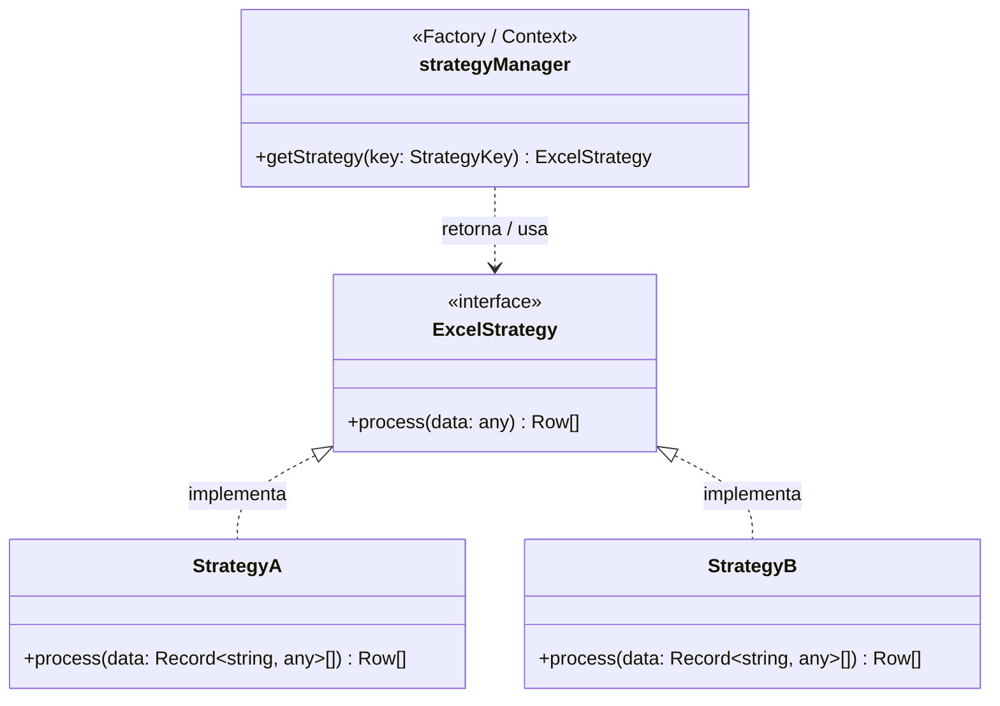

# Strategy Pattern + DDD Template (Excel Example)

La finalidad de este proyecto es servir como un **template** para implementar el **patrón Strategy** en conjunto con la arquitectura de **Domain-Driven Design (DDD)**. Como caso de uso y ejemplo práctico, el proyecto demuestra cómo utilizar distintas estrategias para la lectura y procesamiento de diferentes tipos de archivos o formatos Excel.

## 🧩 Patrón Strategy (Diagrama UML)

A continuación, se presenta un diagrama de clases que ilustra cómo interactúan los componentes en este template para lograr la flexibilidad del patrón Strategy:



- **`ExcelStrategy`**: Es la interfaz que dicta el contrato (el método `process`) que todas las estrategias concretas deben cumplir.
- **`StrategyA` y `StrategyB`**: Son las implementaciones concretas de la interfaz. Cada una tiene su propia lógica de validación y de mapeo de datos al formato común.
- **`strategyManager`**: Actúa como un *Contexto/Fábrica* que contiene las instancias de las estrategias y se encarga de retornar la estrategia correcta en base a una clave (`StrategyKey`) solicitada por el servicio de aplicación.

## 🗂 Estructura del Proyecto

El proyecto sigue una estructura basada en DDD, organizando el código por contextos (bounded contexts) y separándolo en sus respectivas capas (Dominio, Aplicación, Infraestructura y Presentación).

```text
├── src/
│   ├── api/                           # Bounded contexts de la API
│   │   └── excel/                     # Contexto de procesamiento de Excel
│   │       ├── aplication/            # Capa de Aplicación (Servicios y Casos de uso)
│   │       │   └── excel-service.ts
│   │       ├── domain/                # Capa de Dominio (Interfaces core, Estrategias)
│   │       │   ├── excel-strategy.ts
│   │       │   ├── row-builder.ts
│   │       │   ├── strategy-a.ts
│   │       │   └── strategy-b.ts
│   │       ├── helpers/               # Utilidades, esquemas de validación (Zod)
│   │       │   └── schemas.ts
│   │       ├── infraestructure/       # Capa de Infraestructura (Implementación del Manager)
│   │       │   └── strategy-manager.ts
│   │       └── router.ts              # Rutas específicas del contexto Excel
│   ├── app/
│   │   └── app.ts                     # Configuración principal de Express
│   └── routes/
│       └── index.ts                   # Router principal que orquesta todas las rutas
├── main.ts                            # Punto de entrada de la aplicación
├── biome.json                         # Configuración de herramientas (Linter/Formatter)
├── package.json                       # Dependencias y scripts
└── tsconfig.json                      # Configuración de compilación de TypeScript
```

## 🚀 Comandos de Ejecución

El proyecto utiliza `pnpm` como gestor de dependencias. Para ejecutar los siguientes comandos, asegúrate de haber inicializado el repositorio previamente.

### Instalar dependencias
```bash
pnpm install
```

### Iniciar en Desarrollo
Inicia el servidor de desarrollo con recarga automática usando `ts-node-dev`:
```bash
pnpm run dev
```

### Construcción (Build)
Transpila el código TypeScript a JavaScript:
```bash
pnpm run build
```

### Calidad de Código y Formateo
Este proyecto utiliza **Biome** como herramienta rápida y moderna para el linting y formateo del código en el directorio `src`.

- **Ejecutar linter:**
  ```bash
  pnpm run lint
  ```
- **Formatear el código:**
  ```bash
  pnpm run format
  ```
- **Chequeo integral (corrige y formatea todo de una vez):**
  ```bash
  pnpm run check
  ```
